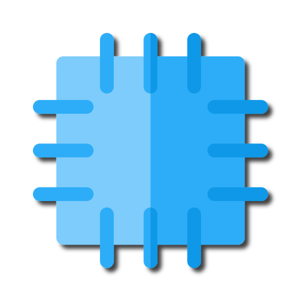

<p align="center">
    
</p>

<h1 align="center">Quilt</h1>

**Quilt** is a next-generation productivity tool for compiling notes and research. It uses machine-learning features such as zero-shot summarization and topic labelling to allow for more control and efficient management of large volumes of information.

### Building

The following steps allow you to run quilt locally:

```bash
git clone --recursive https://github.com/PolyRocketMatt/Quilt.git
cd .\Quilt
python run.py
```

Currently, there are problems with running ```pip install .``` and then ```quilt```. This will be resolved soon.